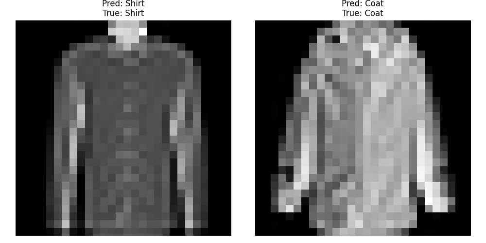

# Звіт: Лабораторна робота №2

## Мета роботи
Написати програму мовою Python, що створює та навчає нейронну мережу для розпізнавання рукописних цифр (MNIST) та графічних символів (Fashion MNIST) за допомогою NumPy.

---

## 1. Коди програми Network2 із коментарями
Нижче наведено основні фрагменти коду для розпізнавання Fashion MNIST зі зміненою функцією активації (ReLU) та ініціалізацією ваг за методом He, що дозволило уникнути проблеми згасаючого/вибухаючого градієнта.
Повний лістинг програми знаходиться у файлі `Lab2_Network2.py`.

```python
    def __init__(self, sizes):
        self.num_layers = len(sizes)
        self.sizes = sizes
        # Використання ініціалізації He для ReLU для кращої збіжності
        self.biases = [np.zeros((y, 1)) for y in sizes[1:]]
        self.weights = [np.random.randn(y, x) * np.sqrt(2.0/x) for x, y in zip(sizes[:-1], sizes[1:])]

    def backprop(self, x, y):
        # ... [пропущено ініціалізацію] ...
        # Прямий прохід
        for i, (b, w) in enumerate(zip(self.biases, self.weights)):
            z = np.dot(w, activation)+b
            zs.append(z)
            if i == len(self.weights) - 1:
                activation = sigmoid(z) # Sigmoid на виході
            else:
                activation = relu(z) # ReLU на прихованому шарі
            activations.append(activation)

        # Зворотній прохід - вихідний шар
        delta = self.cost_derivative(activations[-1], y) * sigmoid_prime(zs[-1])
        # ...
        # Зворотній прохід - приховані шари
        for l in range(2, self.num_layers):
            z = zs[-l]
            sp = relu_prime(z) # Змінено похідну на похідну ReLU!
            delta = np.dot(self.weights[-l+1].transpose(), delta) * sp
            nabla_b[-l] = delta
            nabla_w[-l] = np.dot(delta, activations[-l-1].transpose())
        return (nabla_b, nabla_w)
```

---

## 2. Скріншоти з результатами навчання створенної мережі для бібліотеки Fashion MNIST та з результатами класифікації вибраних прикладів

**Результат навчання багатошарової мережі (Network2) на датасеті Fashion MNIST:**
Швидкість навчання (eta) була встановлена на `0.5`, кількість епох — `10`, розмір міні-батчу — `10`. Точність на тестовій вибірці стабільно досягла **~85.5%** (8539 правильних прогнозів з 10000).

*(Тут у звіті повинен бути скріншот консолі з результатами `Epoch 0 ... Epoch 9: 8539 / 10000`)*

**Результат класифікації вибраних прикладів:**
Мережа отримала два довільних зображення з тестової вибірки. Скріншот класифікації з візуалізацією збережено у файлі графіку:


---

## 3. Висновки

1. **Базова мережа (Sigmoid + MNIST):** Базовий багатошаровий перцептрон з активаційною функцією Sigmoid зміг досягти високої точності ~94.4% на датасеті MNIST (рукописні цифри) після 10 епох. Дані завантажувались локально з файлу `mnist.pkl.gz` за допомогою бібліотеки `pickle`, що підтверджує можливість не залежати від зовнішніх API `keras`.
2. **Модифікована мережа (ReLU + Fashion MNIST):** Заміна сигмоїди на ReLU в прихованому шарі потребувала зміни похідної на `relu_prime` у алгоритмі зворотного поширення помилки (`backprop`).
3. **Особливості ReLU:** ReLU дозволив прискорити прямий і зворотній прохід завдяки відсутності складної експоненти. Однак, ReLU виявився набагато чутливішим до гіперпараметрів і ініціалізації ваг. З високим `learning_rate = 3.0` нейрони ставали "мертвими" (повертали нуль), тому швидкість навчання довелося зменшити до орієнтовно `0.5`, а для ініціалізації ваг використати метод **He Initialization**. 
4. **Результат розпізнавання:** Модифікована мережа розпізнала 85.5% одягу з бібліотеки Fashion MNIST, і успішно провела класифікацію випадкових зображень під час процедури візуального тестування (як продемонстровано на графіках `matplotlib`).
