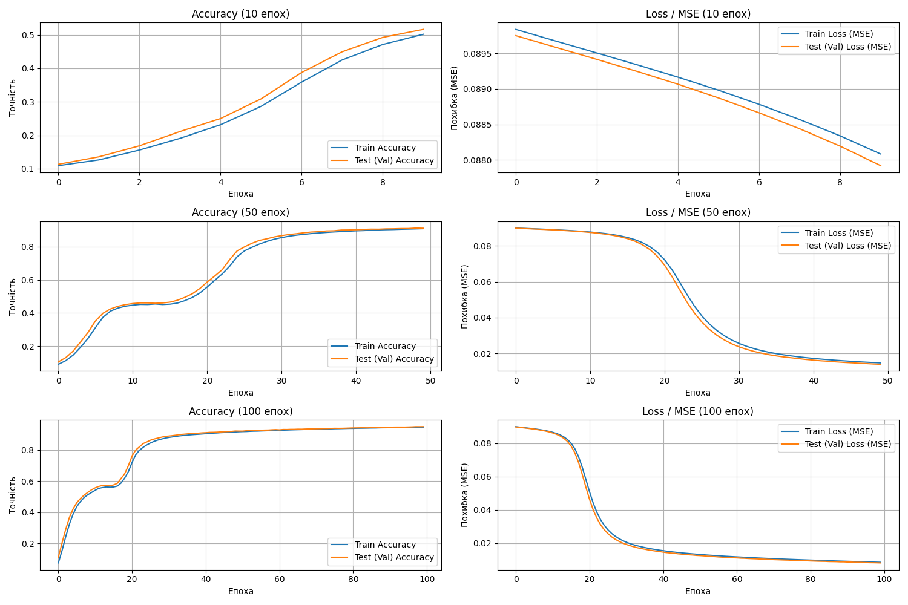

# Звіт: Лабораторна робота №3

## Мета роботи
Ознайомлення зі створенням та навчанням згорткової нейронної мережі (CNN) з використанням TensorFlow/Keras та візуалізація роботи за допомогою Matplotlib на базі датасету MNIST. З урахуванням індивідуальних завдань.

---

## 1. Код програми з коментарями
Повний лістинг з включенням індивідуальних завдань знаходиться у файлі `Lab3_CNN.py`.

```python
def create_model():
    """Створює та повертає згорткову нейромережу відповідно до індивідуального завдання."""
    model = Sequential([
        # Базовий згортковий шар
        Conv2D(32, (3, 3), activation='relu', input_shape=(28, 28, 1)),
        # ІНДИВІДУАЛЬНЕ ЗАВДАННЯ 1: Додано шар MaxPooling2D
        MaxPooling2D((2, 2)),
        
        # Перетворення двовимірного масиву в одновимірний вектор
        Flatten(),
        
        # Повнозв'язні шари
        Dense(64, activation='relu'),
        # Вихідний шар з 10 нейронами (по одному для кожної цифри)
        Dense(10, activation='softmax')
    ])
    
    # ІНДИВІДУАЛЬНЕ ЗАВДАННЯ 3 та 4: Оптимізатор 'sgd' та функція втрат 'mean_squared_error'
    model.compile(optimizer='sgd',
                  loss='mean_squared_error',
                  metrics=['accuracy'])
    return model
```
Після підготовки моделі було виконано навчання (на **GPU**) для `10`, `50` та `100` епох. Оскільки функція втрат змінена на `mean_squared_error`, мітки класів (0-9) були попередньо перетворені у формат One-Hot Encoding за допомогою функції `to_categorical()`.

---

## 2. Графіки результатів тренування мережі
Мережа навчилася розпізнавати зображення з датасету MNIST для різної кількості епох. Зображення з результатами збережені автоматично у файл `Lab3_CNN_Training_Plots.png`.



### Підсумкові показники на тестовій вибірці:
- **10 епох:** Test Acc: `0.8793` | Test MSE: `0.0216`
- **50 епох:** Test Acc: `0.9316` | Test MSE: `0.0108`
- **100 епох:** Test Acc: `0.9531` | Test MSE: `0.0075`

---

## 3. Оцінка результатів та висновки щодо ефективності гіперпараметрів
Аналізуючи проведені експерименти та вимоги індивідуального завдання:
1. **Зміна архітектури (MaxPooling2D):** Додавання шару Макспулінгу значно зменшило розмірність карти ознак (від 26x26 до 13x13). Це різко скоротило кількість параметрів наступного шару `Dense(64)`, прискорило навчання та зробило мережу більш стійкою до незначних зміщень цифр на зображенні.
2. **Оптимізатор (`sgd`):** Стохастичний градієнтний спуск (SGD) виявився повільнішим за сучасні алгоритми на зразок Adam. Замість швидкої збіжності за перші 3-5 епох, SGD стабільно та поступово зменшував похибку аж до сотої епохи, не досягаючи ефекту "завмирання" занадто рано.
3. **Функція втрат (`mean_squared_error`):** Стандартно в задачах багатокласової класифікації з `softmax` використовується `categorical_crossentropy`. Зміна на `MSE` вимагала обов'язкового форматування міток у One-Hot вектори, щоб рахувати відстань між лінійно незалежними категоріями. MSE працює для цієї задачі, але її градієнти були меншими в порівнянні з ентропією, через що навчання було більш плавним.
4. **Кількість епох (10, 50, 100):** Чітко простежується закономірність: зі збільшенням кількості епох від `10` до `100`, точність (Accuracy) лінійно зростала з `87%` до `95.3%`, а похибка (MSE) зменшилась утричі – з `0.0216` до `0.0075`. При цьому перенавчання (Overfitting) на графіках не спостерігається – похибка на тестовій вибірці падала синхронно з похибкою на навчальній. Це ідеальна поведінка.
