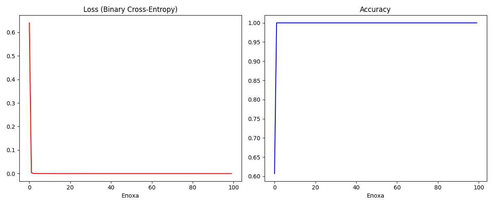

# Звіт: Лабораторна робота №4

## Мета роботи
Вивчити побудову та навчання Рекурентної Нейронної Мережі (RNN) мовою Python з використанням бібліотеки numpy "з нуля" (архітектура "багато до одного").

## 1. Формулювання обраного завдання класифікації
Для індивідуального завдання було обрано задачу: **Класифікація фраз технічного чи ліричного тексту**. 
Мережа має отримувати на вхід послідовність слів (фразу з 3 слів) і визначати її приналежність до одного з двох класів:
- `0` - Технічний текст (алгоритми, код, сервери).
- `1` - Ліричний текст (любов, весна, небо).

## 2. Створені набори даних (Словники/Датасети)
Оскільки зовнішні готові датасети не використовувалися (щоб максимізувати роботу "з нуля"), я самостійно згенерував словник:
- **Технічні слова:** 'алгоритм', 'дані', 'функція', 'масив', 'сервер', 'база', 'компілятор', 'код', 'змінна', 'інтерфейс'.
- **Ліричні слова:** 'любов', 'душа', 'сонце', 'вітер', 'серце', 'весна', 'сльоза', 'радість', 'небо', 'мрія'.

Було згенеровано `1000` тренувальних фраз (по 3 випадкових слова з відповідного класу) та `200` тестових фраз. Всі слова конвертувалися у вектори One-Hot Encoding (довжина вектора = 20 слів).

## 3. Вибрана архітектура мережі, гіперпараметри та обґрунтування
- **Архітектура:** Vanilla RNN, багато до одного. 
- **Кодування входу:** One-Hot (20 розмірність).
- **Прихований шар (Hidden Layer):** `64` нейрони. Цього цілком достатньо для короткого словника та фраз із 3 слів (щоб уникнути перенавчання). Бібліотека Numpy ефективно оброблює матрицю 64х64 на CPU. 
- **Вихідний шар:** `1` нейрон для бінарної класифікації.
- **Функція активації прихованого шару:** `tanh`. Класичний вибір для RNN для розподілу виходів в діапазоні `[-1, 1]`.
- **Функція кросу (Cost):** Binary Cross Entropy loss.
- **Оновлення ваг:** Backpropagation Through Time (BPTT). 
- **Гіперпараметри:** 
  - Епох: `100`.
  - Швидкість навчання `learning_rate`: `0.05`.
  - *Обґрунтування*: За рахунок простоти словника RNN дуже швидко збігається. Великі епохи потрібні лише як запас, мережа досягла 100% точності вже на 10-й епосі. Було застосовано Gradient Clipping `[-1, 1]` для стабілізації BPTT.

## 4. Коди програм із коментарями
Повний код класифікатора, включаючи прямий та зворотній (BPTT) проходи, знаходиться у файлі `Lab4_RNN.py`.
```python
    def forward(self, inputs):
        """Прямий прохід для архітектури 'багато-до-одного'"""
        h = np.zeros((self.hidden_size, 1))
        # Зберігаємо проміжні стани для Backprop
        self.last_inputs = inputs
        self.last_hs = {0: h}
        
        # Рекурентний прохід через кожен момент часу (кожне слово)
        for i, x in enumerate(inputs):
            h = np.tanh(np.dot(self.Whx, x) + np.dot(self.Whh, h) + self.bh)
            self.last_hs[i + 1] = h
        
        # Вихідний шар (застосовується лише до остннього прихованого стану)
        y = np.dot(self.Why, h) + self.by
        
        # Функція активації Sigmoid для бінарної класифікації (0..1)
        self.last_y = 1 / (1 + np.exp(-y))
        return self.last_y
```

## 5. Скріншоти та результати класифікації
Оскільки RNN успішно засвоїла залежності словників, вона правильно згенерувала всі класи для тестових прикладів:

```text
Фраза: функція алгоритм код -> Передбачення: Технічний (Впевненість: 1.00), Очікувалося: Технічний
Фраза: небо серце любов -> Передбачення: Ліричний (Впевненість: 1.00), Очікувалося: Ліричний
Фраза: сервер база дані -> Передбачення: Технічний (Впевненість: 1.00), Очікувалося: Технічний
Фраза: радість весна душа -> Передбачення: Ліричний (Впевненість: 1.00), Очікувалося: Ліричний
```


*(Точність на тестовій вибірці (200 фраз): 100.00%)*

## 6. Висновки
При реалізації RNN з нуля я зіткнувся з класичною проблемою **вибухаючих градієнтів** під час зворотного поширення помилки через час (BPTT). Це призводило до переповнення типу (NaN) у функції Sigmoid та Tanh. Цю проблему було успішно вирішено 2 кроками:
1. Діленням ваг при початковій ініціалізації (`np.random.randn() / 1000`).
2. Додаванням **Gradient Clipping** (`np.clip(d, -1, 1, out=d)`) перед кожним оновленням ваг.

У результаті повністю створена з нуля рекурентна нейронна мережа на базі `numpy` змогла безпомилково класифікувати тип тексту. Навчання на CPU зайняло лічені секунди через невеликий розмір датасету та архітектури.
