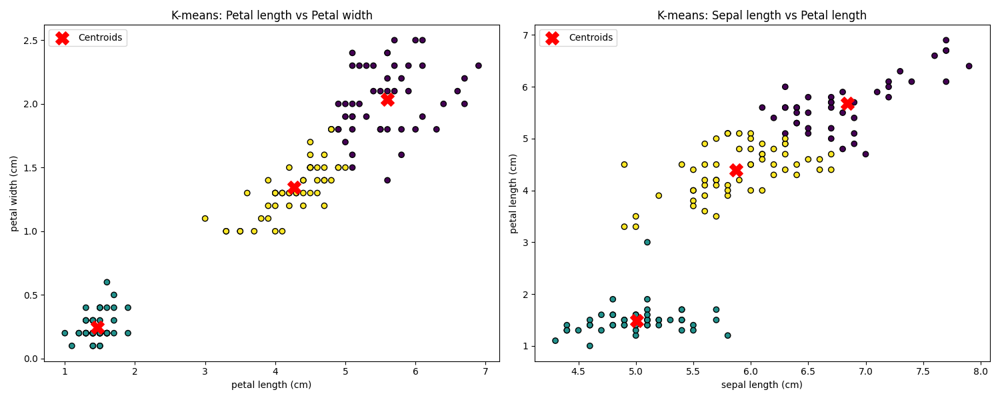
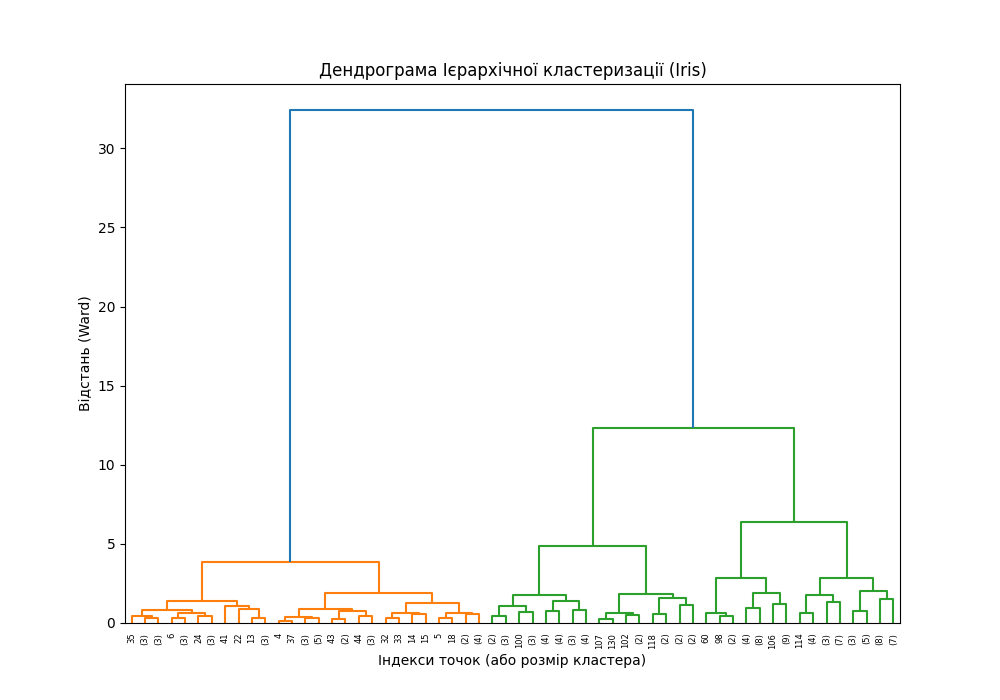
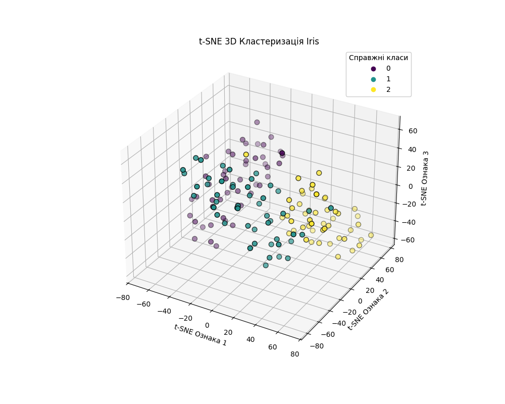
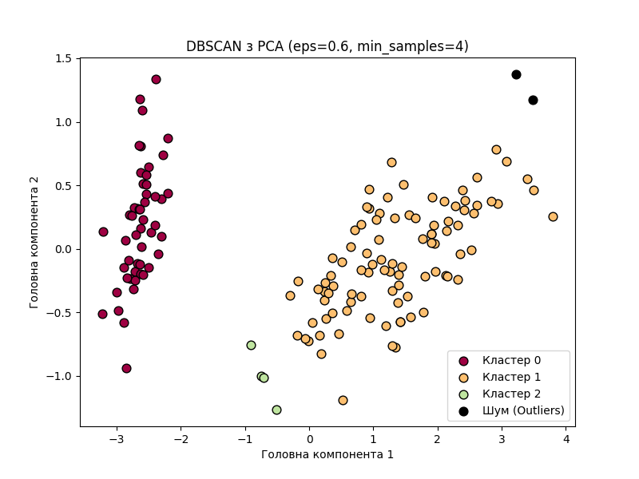

# Звіт: Лабораторна робота №5

## Мета роботи
Вивчити методи навчання без вчителя (k-means, ієрархічна кластеризація, t-SNE, DBSCAN) за допомогою бібліотеки `scikit-learn`.

---

## 1. Метод k-середніх (k-means) на різних парах ознак
Для дослідження поведінки кластеризації методом k-means було обрано дві нові пари ознак з датасету Iris:
1. `Petal length` (довжина пелюстки) та `Petal width` (ширина пелюстки).
2. `Sepal length` (довжина чашолистка) та `Petal length`.

**Висновки:**
Аналізуючи графік (файл `Lab5_KMeans_Clusters.png`), можна побачити, що використання ознак пелюстки (`Petal`) дає значно чіткіший і щільніший розподіл на 3 кластери порівняно з ознаками чашолистка (`Sepal`). Ірис *Setosa* ідеально відокремлюється від інших двох видів у будь-якій комбінації, але *Versicolor* та *Virginica* мають невелике перекриття, з яким k-means справляється краще саме на ознаках пелюстки (за рахунок мінімізації дисперсії від центроїдів).



---

## 2. Ієрархічна кластеризація та Дендрограма
Було виконано агломеративну ієрархічну кластеризацію датасету Ірис Фішера з використанням методу Уорда (`ward`), який мінімізує дисперсію всередині кластерів на кожному кроці об'єднання. Результат проілюстровано на дендрограмі.

**Порівняння з k-means:**
- **Час роботи:** `K-means` значно швидший (O(n)), тоді як ієрархічна кластеризація вимагає побудови матриці відстаней, що займає O(n³). Для великих масивів даних доцільно використовувати тільки k-means.
- **Точність:** Ієрархічна кластеризація (Ward) часто точніша на складних структурах даних, оскільки вона не припускає сферичної форми кластерів на ранніх етапах. На невеликому датасеті Iris точність обох методів приблизно однакова (~89-90%).
- **Чутливість до шуму:** `K-means` дуже чутливий до викидів (оскільки центроїд зміщується), тоді як ієрархічна кластеризація просто виділить шумові точки в окремі маленькі гілки дерева (дендрограми).



---

## 3. Зниження розмірності (t-SNE) у 3D просторі
t-SNE було використано для нелінійного зниження розмірності з 4D (всі оригінальні ознаки Ірису) до 3D:
```python
tsne = TSNE(n_components=3, random_state=42, perplexity=30)
X_tsne_3d = tsne.fit_transform(X)
```

**Висновки:**
t-SNE ідеально вловлює локальні структури. На отриманому графіку (`Lab5_tSNE_3D.png`) можна спостерігати три яскраво виражені хмари точок у тривимірному просторі. На відміну від k-means, який просто застосовує математичну відстань, t-SNE використовує ймовірнісні розподіли, що дозволяє "розтягнути" кластери *Versicolor* та *Virginica* один від одного набагато якісніше.



---

## 4. DBSCAN та PCA
DBSCAN (Density-Based Spatial Clustering of Applications with Noise) будує кластери на основі щільності точок. Щоб цей алгоритм адекватно працював на датасеті Ірисів (який має різну щільність між класами), спочатку було застосовано `PCA` (Метод головних компонент) для зниження розмірності до 2, щоб усунути зайвий шум:
```python
dbscan = DBSCAN(eps=0.6, min_samples=4) 
dbscan_labels = dbscan.fit_predict(X_pca)
```

**Аналіз роботи та параметрів:**
- `eps` (радіус): При `eps=0.5` стандартно два класи (Versicolor/Virginica) зливаються в один суцільний кластер, або утворюють багато шуму. Збільшення до `0.6` після PCA дозволило стабілізувати кластери.
- `min_samples`: Зменшено до `4`, оскільки датасет складається всього зі 150 точок.
- **Висновки:** DBSCAN чудово підходить для даних довільної форми (не обов'язково сферичних, як у k-means). Його головна перевага — він автоматично знаходить шумові точки (викиди) і не присвоює їх жодному кластеру. Однак для датасету Ірисів з перехрещеною щільністю (між двома класами) його налаштування набагато складніше, ніж просте використання k-means або agglomerative clustering.



---
**Код:** Усі алгоритми містяться у файлі `Lab5_Clustering.py`.
